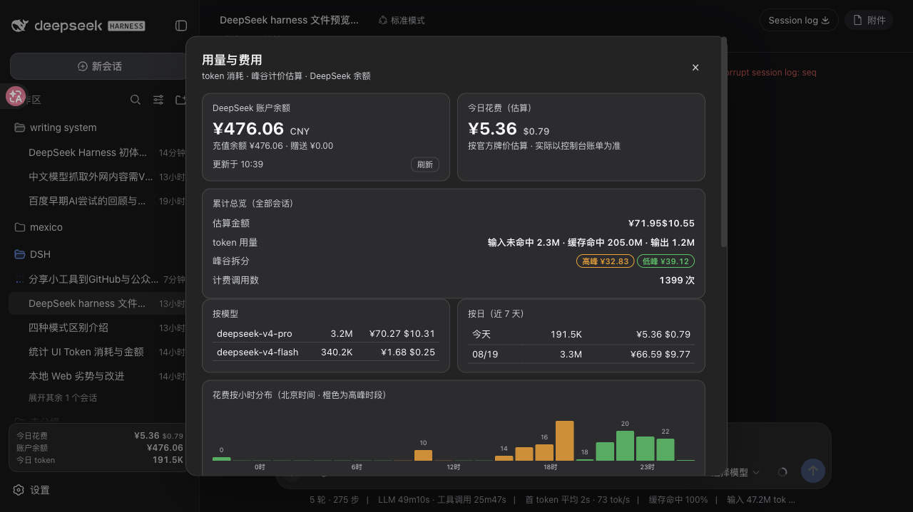
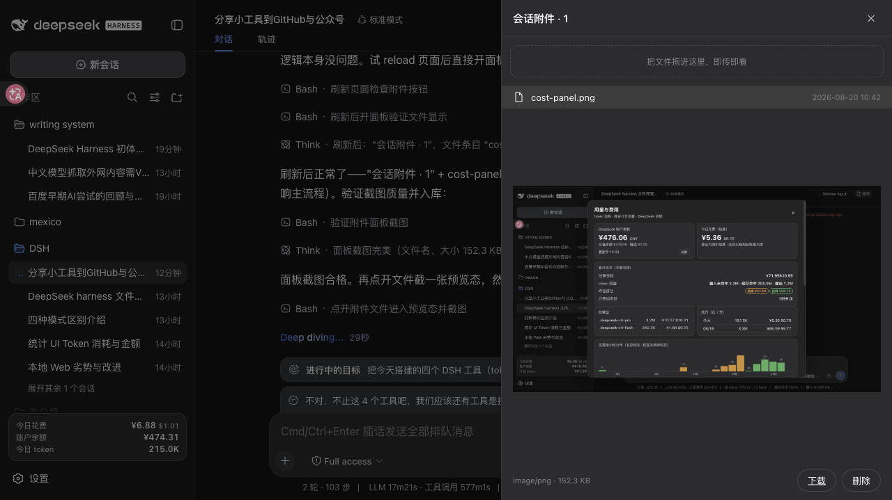

# DSH 装备升级套件 · dsh-upgrade-kit

给 [DeepSeek Harness](https://github.com/deepseek-ai/deepseek-harness)（DSH）补上五件趁手装备：**看钱、看文件、搜外网、看图片、通微信**。一条命令全装，装完即用。

## 五件装备

| # | 装备 | 一句话 | 装完你在哪看到它 |
|---|---|---|---|
| 1 | 💰 **dsh-cost** 用量与费用面板 | token 消耗、峰谷计价估算、DeepSeek 官方真实余额，本地台账可对账 | 侧栏底部 **¥ 按钮** |
| 2 | 📄 **dsh-plugin-file-preview** 文件预览 | 每条回复产出的文件自动挂预览卡片，会话附件一键预览，拖文件进窗口即上传 | 会话头部 **「附件」按钮** + 回复尾部的**文件卡片** |
| 3 | 🌐 **dsh-research-mcp** 外网搜集 | 多引擎国际搜索（DDG/HN/arXiv/GitHub）+ 网页全文抓取 + 站点经验，**零 API key** | 模型自动获得 `mcp__research__search` 等 3 个工具 |
| 4 | 👁 **vision-bridge** 视觉桥接 | 无视觉模型也能看图：描述 / OCR / 报错截图 / UI 元素坐标 | 在聊天里**贴图说"看这张图"** 自动触发 |
| 5 | 💬 **dsh-wechat-bridge** 微信双向通道 | 微信里发消息 → 本机执行 → 结果回微信（持久记忆）；agent 也能主动推消息到你微信 | 扫码后**直接在微信里指挥 DSH**，会话同步挂进 WebUI |

## 效果预览

**dsh-cost · 用量与费用面板**（侧栏 ¥ 按钮）：



**dsh-plugin-file-preview · 附件预览面板**（会话头部「附件」按钮）：



## 安装（两种方式）

**方式 A · macOS 一键安装包（推荐小白）**

到 [GitHub Releases](https://github.com/piggy00544/dsh-upgrade-kit/releases) 下载 `DSH-Upgrade-Kit-*.dmg`，双击装上，打开填 DeepSeek API key 就能用。DSH 本体和五件装备全部内嵌，无需装 Node/终端。

**方式 B · 命令行（已装 DSH 的用户）**

```bash
curl -fsSL https://raw.githubusercontent.com/piggy00544/dsh-upgrade-kit/main/install.sh | bash
```

装完重启 DSH web（`launchctl kickstart -k gui/$(id -u)/com.deepseek.dsh-web`，或重启你的 dsh web 进程），侧栏就会长出 ¥ 按钮和「附件」按钮。

唯一需要手动配的是 vision-bridge 的视觉 key 和微信扫码（都不配也不影响其他装备）：

```bash
# 视觉 key（可选）
cp ~/.agents/skills/vision-bridge/config.example.json ~/.config/vision-bridge/config.json
chmod 600 ~/.config/vision-bridge/config.json
# 编辑填入任一 provider 的 apiKey（推荐阿里百炼 DashScope，新用户限免 50 万 token）

# 微信扫码（可选）：~/bin/dsh-wechat.mjs login
```

## 各装备详情

- [plugins/dsh-cost/README.md](plugins/dsh-cost/README.md) — 费用面板（余额 + 峰谷计价 + 会话明细）
- [plugins/dsh-plugin-file-preview/README.md](plugins/dsh-plugin-file-preview/README.md) — 文件预览（产物卡片 + 附件面板 + 拖拽上传）
- [plugins/research-mcp/README.md](plugins/research-mcp/README.md) — 外网搜集 MCP（多引擎搜索 + 全文抓取）
- [skills/vision-bridge/README.md](skills/vision-bridge/README.md) — 视觉桥接（云端视觉模型，OCR/UI 坐标）
- [plugins/wechat-bridge/README.md](plugins/wechat-bridge/README.md) — 微信双向通道（收发守护 + 持久记忆 + WebUI 挂会话）

## 卸载

```bash
dsh plugin --profile web remove dsh-cost dsh-plugin-file-preview
rm -rf ~/.agents/skills/vision-bridge ~/.local/share/dsh-upgrade-kit
rm -f ~/bin/dsh-wechat.mjs ~/bin/dsh-wechat-daemon.mjs ~/bin/dsh-notify ~/bin/dsh-notify-wechat
launchctl bootout gui/$(id -u)/com.deepseek.dsh-wechat-daemon 2>/dev/null || true
# 编辑 $DSH_HOME/profiles/web/cordis.patch.yml，删掉 dsh-cost / file-preview / mcp-research 三段后重启
```

## 常见问题

**Q: 装完没看到 ¥ 按钮？** 重启 web 了吗？`dsh plugin --profile web add link:...` 只会影响已重启的进程。还不行就确认 `$DSH_HOME/profiles/web/cordis.patch.yml` 里有 `id: dsh-cost` 段。

**Q: 余额对不上账单？** 面板金额按官方公开牌价估算，真实扣费以 platform.deepseek.com 账单为准，面板里两者并排显示方便对账。

**Q: 搜索工具没出现？** MCP 注册发生在 web 进程启动时。确认 cordis.patch.yml 里 `id: mcp-research` 段存在且 `server.mjs` 路径正确，然后重启。

**Q: vision-bridge 提示没有 key？** 你还没配 `~/.config/vision-bridge/config.json`，或某个 provider 的 apiKey 是空的。`node ~/.agents/skills/vision-bridge/scripts/vision.mjs --list` 可查看哪些 provider 已配 key。

**Q: 微信桥没反应？** 依次检查：`dsh-wechat.mjs status` 是否已登录（`login` 扫码）→ daemon 是否在跑（`launchctl list | grep wechat`）→ `~/.local/share/dsh-wechat/daemon.log` 最新日志。

**Q: 隐私？** 费用台账、会话文件全部本地处理，不联网上传。外发只有两处：vision-bridge 把图片发给云端视觉模型（自选 provider），以及微信桥走微信 iLink bot 官方接口（凭证 0600 本地保存，只认扫码人消息）。

## 许可

MIT License。vision-bridge 核心脚本 vendored 自 [JochenYang/luma-mcp](https://github.com/JochenYang/luma-mcp)（MIT）。macOS 安装包构建见 [macos/](macos/)。

> 本仓库是第三方社区项目，与 DeepSeek 官方无关。"DeepSeek Harness" 为 DeepSeek 注册商标，本页仅在说明兼容对象时提及。
